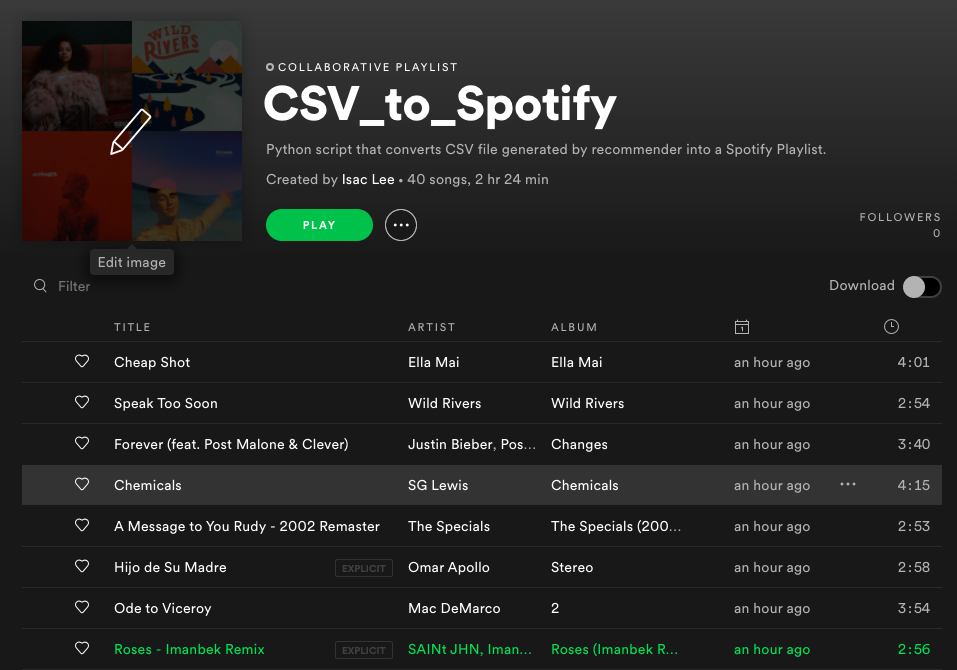

# CSV-to-Playlist
A Python script that converts .csv playlist files into Spotify Playlist.

## Motivations
With this script, I was able to automate creating playlists with my song recommendations .csv that were generated from my song-recommender project, and can schedule the script to run weekly, similar to Spotify's Discover Weekly playlist. 

## Instructions
1. Obtain OAUTH token and Spotify User-ID.
2. Create "secrets" Python file in same directory and import the token and user-id into the csv-to-playlist.py. 
3. Run script. 

## Limitations
CSV files must have two columns named "track" and "artist" to represent the song title and, obviously, the artist. If the specified song is not in Spotify, an error will occur. 

## Example of a playlist

